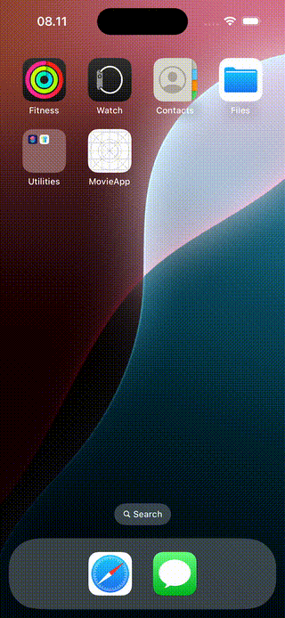

# Movie App

A simple iOS app that allows users to search and view movies by utilizing the [OMDb API](http://www.omdbapi.com/).



## Prerequisites

To run this project, ensure you have the following installed:

- Xcode 16.1 or later
- Ruby 3.3.6

## Tech Stack

This project follows a modern development approach using the following technologies:

- **Architecture**: Model-View-ViewModel (MVVM)
- **UI Framework**: SwiftUI
- **Asynchronous Programming**: Async/Await & Combine
- **Unit Testing**: Cuckoo, Nimble, and Quick

## Installation

This project uses Gemfile and CocoaPods for dependency management. First, install the required gems and CocoaPods dependencies:

```bash
  bundle install
  bundle exec pod install
```

You will need to create an API key from the OMDb API service. Once you have your key, add it to the project by placing it in `MovieAppConstant.apiKey`.

```swift
enum MovieAppConstant {
    static let baseUrl = "http://www.omdbapi.com/"
    static let apiKey = "<your_api_key_here>"
}
```

## Authors
[@indratir](https://www.github.com/indratir)